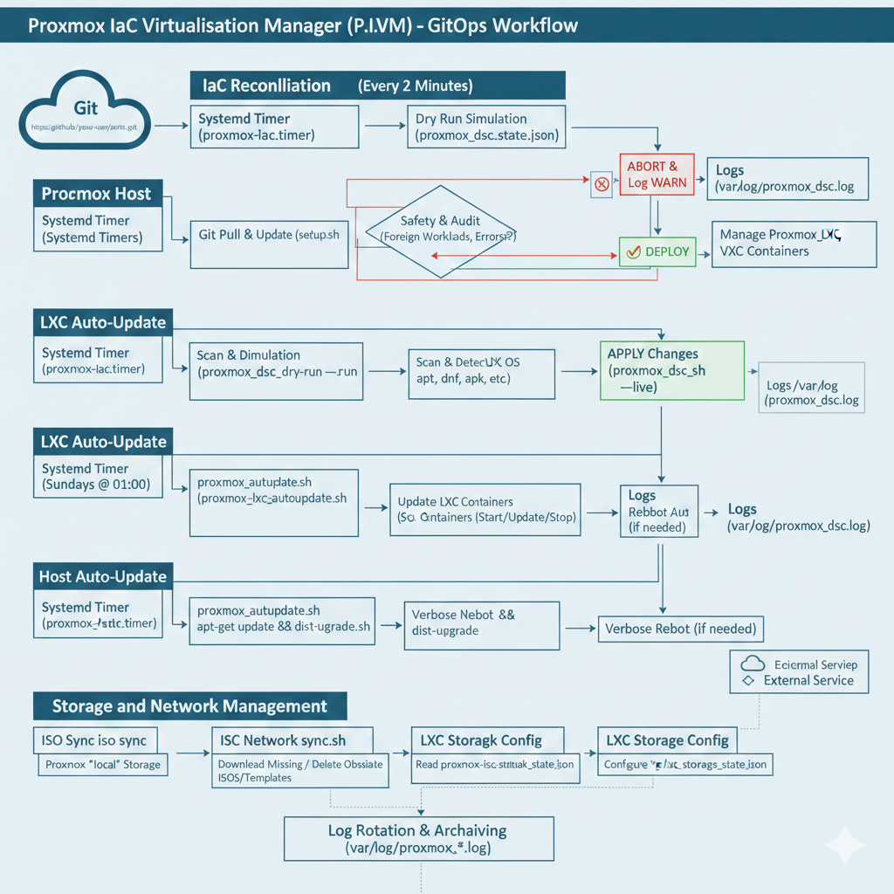

# Proxmox IaC Virtualisation Manager (P.I.V.M) Utility

This repository contains a lightweight, bash-based Infrastructure as Code (IaC) solution for Proxmox VE. It utilizes a **Desired State Configuration (DSC)** methodology to ensure that Virtual Machines (QEMU) and Containers (LXC) strictly match a defined JSON manifest.

The solution is designed to be **self-healing**, **idempotent**, and **safe**, operating on a strict "GitOps" workflow.

🚀 Capabilities
1. Desired State Configuration (IaC)
Unified Management: Controls Virtual Machines (QEMU) and Containers (LXC) from a single state.json manifest.
Drift Detection: Automatically corrects configuration drift (RAM, Cores, Hostname) and enforces Power State.
Foreign Workload Protection: Blocks deployment if "Unmanaged" resources are detected on the host, preventing accidental overlaps.
It is broken into three main sections. (ONE) Compute, (TWO) Storage, (THREE) Network.
Each section has distinct roles with their own state.json files.
This means that a HOST or multiple GUESTS can be managed from the three sections with an attributed state json file.

2. Automated Host Maintenance
OS Updates: Automatically performs apt-get update and dist-upgrade for Proxmox VE.
Safe Reboots: Performs a verbose reboot after updates to ensure the latest kernel is active.
Loop Prevention: Scheduled strictly via Calendar time to prevent reboot loops.

3. Automated LXC Patching
Universal Updater: Detects the OS of every LXC container (Debian, Ubuntu, Alpine, Fedora, Arch, etc.) and runs the appropriate package manager update commands.
Smart State Handling:
Running Containers: Updated live.
Stopped Containers: Temporarily started, updated, and shut down again.
Reboot Audit: Logs which containers require a reboot after patching.

## 🚀 Key Features

* **Unified Management:** Manages both LXC Containers (`pct`) and Virtual Machines (`qm`) from a single JSON state file.
* **Idempotency:** The script runs every 2 minutes. If the environment matches the state file, no action is taken.
* **Drift Detection:** Automatically corrects configuration drift (e.g., RAM, Cores, Hostname) and enforces Power State (Running/Stopped).
* **Foreign Workload Protection:** Scans the host for "Unmanaged" resources. If a Foreign VM/LXC is detected, **deployment is blocked** to prevent accidental overlaps, and a JSON snippet is generated for easy adoption.
* **GitOps Workflow:** The host automatically updates itself from this git repository before every run.



---

** 📅 Automation Schedule
The system runs on three independent Systemd timers to ensure separation of duties:

| **Service** | **Schedule** | **Description** |
| --- | --- | --- |
| **IaC Reconciliation** | **Every 2 Minutes** | Pulls git changes, validates `state.json`, and enforces VM/LXC configuration. |
| **LXC Auto-Update** | **Sundays @ 01:00** | Patches all LXC containers found on the host. |
| **Host Auto-Update** | **Sundays @ 04:00** | Updates Proxmox VE host packages and performs a system reboot. |

---

## 🔄 The Workflow (GitOps)

This solution runs automatically via a Systemd Timer. The execution flow is strictly defined to ensure safety:

1.  **Git Pull & Update:** The wrapper checks this repository for new commits. If a new version exists, it pulls the code and re-runs the installer (`setup.sh`) to update the host logic immediately.
2.  **Dry Run Simulation:** The `proxmox_dsc.sh` engine runs in `--dry-run` mode. It simulates changes without applying them.
3.  **Safety & Audit:**
    * It scans the host for **Foreign Workloads** (VMs not in `state.json`).
    * It checks for **Configuration Errors**.
4.  **Decision Gate:**
    * **⛔ BLOCK:** If *any* Foreign Workloads or Errors are found, the process **aborts**. No changes are made. An alert is logged.
    * **✅ DEPLOY:** If the environment is clean and safe, the script runs in "Live" mode to enforce the `state.json` configuration.
5.  **Post-Run:** Logs are rotated and stored in `/var/log/proxmox_dsc.log`.

---

## 🛠️ Installation

### Prerequisites
* Proxmox VE Host (Debian-based).
* Root access.
* Internet connection (for `apt` and `git`).

### Quick Start
1.  **SSH into your Proxmox Host.**
2.  **Clone this repository:**
    ```bash
    cd /root
    git clone [https://github.com/your-user/pivm.git](https://github.com/your-user/pivm.git) pivm
    cd pivm
    ```
3.  **Edit the Variables File:**
    ```bash
    vi variables.json
    ```
4.  **Run the Setup Script:**
    ```bash
    ./setup.sh
    ```
5.  **Wait for the Setup Script to finish.**
    ```bash
    tail -f /var/log/proxmox_master.log
    ```
6. **Uninstall if no longer required.**
    ```bash
    ./uninstall.sh
    rm -rf /root/pivm
    ```

**That's it.** The `setup.sh` script will:
* Install dependencies (`jq`, `git`, `wget`).
* Deploy the scripts to `/root/pivm-core/`.
* Configure Log Rotation.
* Install and Start the Systemd Timer (running every 2 minutes).

---

## 📄 Configuration (`proxmox_dsc_state.json`)

Your infrastructure is defined in `proxmox_dsc_state.json`. The script supports two types of resources: `"lxc"` and `"vm"`.

### Example Manifest
```json
[
  {
    "type": "lxc",
    "vmid": 100,
    "hostname": "web-01",
    "template": "local:vztmpl/debian-12-standard_12.2-1_amd64.tar.zst",
    "memory": 1024,
    "cores": 2,
    "net0": "name=eth0,bridge=vmbr0,ip=dhcp",
    "storage": "local-lvm:8",
    "state": "running"
  },
  {
    "type": "vm",
    "vmid": 200,
    "hostname": "db-01",
    "template": "local:iso/debian-12.0.0-amd64-netinst.iso",
    "memory": 4096,
    "cores": 4,
    "net0": "virtio,bridge=vmbr0",
    "storage": "local-lvm:32",
    "state": "running"
  }
]
```

### Field Reference

| **Field** | **Description** | **LXC Note** | **VM Note** |
| --- | --- | --- | --- |
| `type` | `lxc` or `vm` | Required | Required |
| `vmid` | Unique ID | Proxmox ID | Proxmox ID |
| `hostname` | System Name | Sets hostname | Sets VM Name |
| `template` | Source Image | Path to `.tar.zst` | Path to `.iso` (CDROM) |
| `memory` | RAM in MB | Dynamic | Dynamic |
| `cores` | CPU Cores | Dynamic | Dynamic |
| `storage` | Disk Config | Size in GB (e.g. `local-lvm:8`) | SCSI0 Size (e.g. `local-lvm:32`) |
| `net0` | Network String | e.g. `name=eth0,bridge=vmbr0,ip=dhcp` | e.g. `virtio,bridge=vmbr0` |
| `state` | Power State | `running` or `stopped` | `running` or `stopped` |

* * * * *

🛡️ Handling Foreign Workloads
------------------------------

If you create a VM manually (outside of this repo), the system will enter **Safe Mode**.

1.  The next scheduled run will detect the unmanaged VM ID.

2.  It will log a **WARN** event and **Abort** the deployment to prevent conflict.

3.  **To Fix:** Check the logs for the "Suggested Import" block.

Bash

```
tail -f /var/log/proxmox_dsc.log

```

**Output Example:**

Plaintext

```
[WARN] FOREIGN vm DETECTED: VMID 105
...
--- SUGGESTED JSON IMPORT FOR VM 105 ---
{
  "type": "vm",
  "vmid": 105,
  "hostname": "test-vm",
  ...
}

```

1.  Copy this JSON block into your `proxmox_dsc_state.json`, commit, and push.

2.  The next run will detect the update, recognize the VM, and resume management.

* * * * *

💿 ISO and Template Lifecycle Management
---------------------------

This node enforces **Strict State Reconciliation** for ISO images stored in the local Proxmox storage. It ensures that only the ISOs defined in your configuration exist on the disk, saving space and ensuring version compliance.

### The Workflow
1.  **Read Manifest:** The service reads `proxmox_iso_sync.json`.
2.  **Download:** If a file listed in the JSON is missing from the disk, it is downloaded immediately.
3.  **Cleanup:** If a file exists on the disk but is **NOT** in the JSON, it is detected as "Obsolete" and **Deleted**.

### Configuration (`proxmox_iso_sync.json`)

Manage your ISOs by editing this file. To update an OS version, simply change the `filename` and `url`. The script will download the new one and delete the old one automatically.

JSON

```
[
  {
    "os": "Debian",
    "version": "13.2",
    "filename": "debian-13.2.0-amd64-netinst.iso",
    "url": "https://cdimage.debian.org/debian-cd/current/amd64/iso-cd/debian-13.2.0-amd64-netinst.iso"
  },
  {
    "os": "Ubuntu",
    "version": "22.04",
    "filename": "ubuntu-22.04.5-live-server-amd64.iso",
    "url": "https://releases.ubuntu.com/jammy/ubuntu-22.04.5-live-server-amd64.iso"
  },
      {
        "os": "Proxmox VE 9",
        "source_page": "https://enterprise.proxmox.com/iso/",
        "pattern": "proxmox-ve-9.[0-9]+-[0-9]+.iso"
    },
    {
        "os": "Home Assistant OS",
        "version": "16.3",
        "source_page": "https://github.com/home-assistant/operating-system/releases/download/",
        "pattern": "haos_ova-${version}.qcow2.xz"
    }
]

```
### Schedule
-   **Service:** `proxmox-iso-sync.service`
-   **Schedule:** Runs Daily at **02:00 AM**.
-   **Log File:** `/var/log/proxmox_iso_sync.log`

### Storage Location

The script automatically detects the path for the storage named `local` (typically `/var/lib/vz/template/iso`). If you use a different storage ID for ISOs, edit the `STORAGE_ID` variable in `proxmox_iso_sync.sh`.

### Added Template Feature

VM Guests can sometimes be downloaded from the internet, with a file formt of qcow or oci.
These files are not like ISO images that can be mounted and used as installation media, but pre-configured as a virtual machine.
To ensure available templates are up to date, the script will download the latest version of the template and delete the old one automatically, whilst decompressing the contents, creating a template after an import and registering it as a new image.

## 📂 Repository Structure

| **File** | **Description** |
| --- | --- |
| `setup.sh` | The installer. Deploys everything. |
| `uninstall.sh` | The uninstaller. Removes everything. |
| `variables.json` | The variables file. |
| `LICENSE` | The license file. |
| `README.md` | This file. |
| `common.lib` | A common library for all the scripts. |
| `compute/host/proxmox_autoupdate.sh` | Host OS Update & Reboot script. |
| `compute/host/proxmox_autoupdate.json` | Host OS Update & Reboot timer. |
| `compute/guest/proxmox_dsc.sh` | The Core IaC Engine (Logic for `pct` and `qm`). |
| `compute/guest/proxmox_dsc_state.json` | The Infrastructure Manifest. |
| `compute/guest/proxmox_lxc_autoupdate.sh` | LXC Container Patching script. |
| `compute/guest/proxmox_lxc_autoupdate.json` | LXC Container Patching timer. |
| `storage/host/proxmox_iso_sync.sh` | ISO State Reconciliation script. |
| `storage/host/proxmox_iso_sync.json` | The ISO Manifest. |
| `network/guest/proxmox_lxc_network.sh` | Network Configuration script for LXC. |
| `network/guest/proxmox_lxc_network_state.json` | The Network Manifest for LXC. |
| `storage/guest/proxmox_lxc_storage.sh` | Storage Configuration script for LXC. |
| `storage/guest/proxmox_lxc_storage_state.json` | The Storage Manifest for LXC. |


## 📊 Logging & Troubleshooting
----------------------------

All logs are rotated daily and kept for 7 days.

| **Component** | **Log Location** | **Systemd Status** |
| --- | --- | --- |
| **IaC Engine** | `/var/log/proxmox_dsc.log` | `systemctl status proxmox-iac.timer` |
| **Host Update** | `/var/log/proxmox_autoupdate.log` | `systemctl status proxmox-autoupdate.timer` |
| **LXC Update** | `/var/log/proxmox_lxc_autoupdate.log` | `systemctl status proxmox-lxc-autoupdate.timer` |

